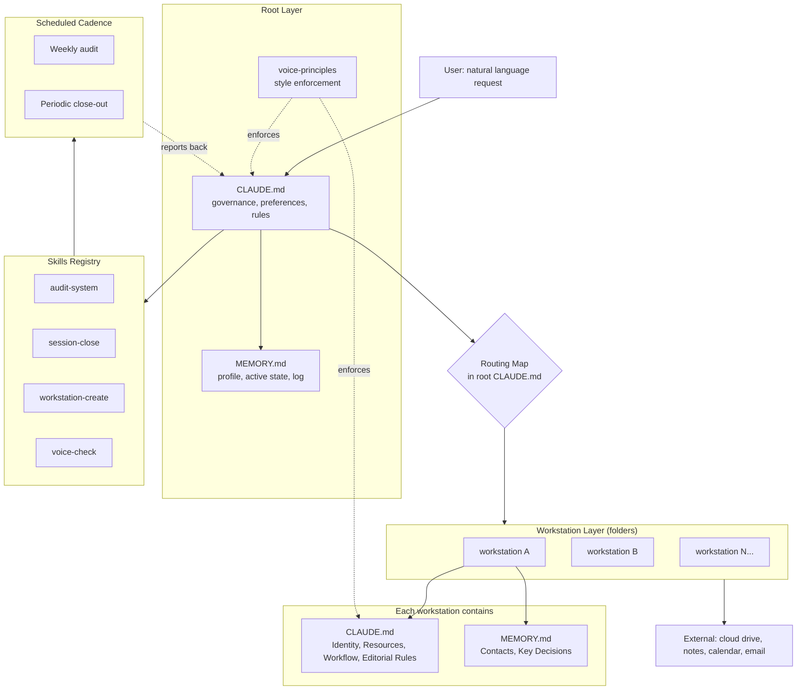

# Architecture

The system is a small set of Markdown files arranged in a deliberate hierarchy, plus a few Python scripts that consume the data the Markdown describes. There is no application binary, no database, no API. The Markdown is the interface.

A rendered PNG of the same diagram sits at `screenshots/architecture.png`. The Mermaid source is at `screenshots/architecture.mmd`.

## Two-tier memory

The simplest design that did not get adopted was a single monolithic memory file. The reason it gets rejected is friction. A single file grows past usability in a few months. The system instead splits memory across two tiers.

Root memory holds cross-cutting context: who the user is, what they are working on at the top level, which workstation handles which kind of request. Workstation memory holds domain-specific context: contacts, decisions, statuses scoped to that workstation only.

Both tiers are loaded at session start, but workstation memory only contributes detail when the routing map decides the workstation is in scope. Any given session reads only what it needs.

## Workstation isolation

Workstations are folders. Not git repositories, not databases, not applications. A folder with two files (CLAUDE.md, MEMORY.md) and optionally a resources subfolder is a complete workstation.

The four-section pattern (Identity, Resources, Workflow, Editorial Rules) is mandatory. Identity defines the boundary, including what does not belong here. Resources points at reference files. Workflow lists the steps for the primary task. Editorial Rules sets the voice and tone for this domain on top of the central voice principles.

Workstations cannot reach into each other. Cross-cutting concerns sit at the root. This is enforced by the file edit guards and the audit, not by code.

## File edit guards

The most non-obvious decision in the design, and the most important. The assistant cannot edit any CLAUDE.md or MEMORY.md without explicit per-session permission. It proposes the change in chat, the user approves with one word, then the assistant writes.

The rule is enforced behaviourally, not technically. The system relies on the assistant following the rule. The rule is repeated in every CLAUDE.md so it is always in context. The pattern works because the cost of drift is high and the cost of asking is low.

A narrow exception exists for workstations where factual entries (for example, "did X on date Y") follow a stated format. Those can be auto-written at session close. The exception is documented in that workstation's CLAUDE.md so it does not expand by precedent. See ADR 0005 for the full reasoning.

## Scheduled audits

A weekly scheduled task triggers the `audit-system` skill. The audit walks the entire tree and produces a report categorised as CRITICAL, WARNING, INFO. It proposes fixes but does not write anything.

Drift is the failure mode for a self-maintained system. Without scheduled audits, structural problems accumulate until something breaks visibly. With them, drift surfaces within seven days and the user can act on it before it compounds.

## Skills registry

Skills are Markdown files in `/skills/`. Each has frontmatter (name, description) and a body that describes how it runs. The description doubles as the trigger. When the user's intent matches the description, the skill loads and runs.

The registry pattern means recurring tasks (audit, session close, workstation creation, voice check) run the same way every time. No drift between instances of the same task.

## What broke, what got fixed

The system in its early form had no MEMORY scope rule. Workstation MEMORY.md files started accumulating change-log entries: "Updated decision X on date Y, previously read Z." Within a few weeks the memory files were as much history as state. Reading them at session start became expensive and the actual current facts got buried under their own audit trail.

The fix was one rule added to root governance: MEMORY.md holds facts only. No change logs, no version notes, no edit history. Change history lives in git. State lives in MEMORY. The rule was added once, a single consolidation pass cleaned the existing files, and the rule has held since.

This is the pattern. Most structural failures resolve to a missing rule. The fix is to add the smallest rule that closes the gap permanently and apply it across every relevant file. Never patch a behavioural gap with new infrastructure.
